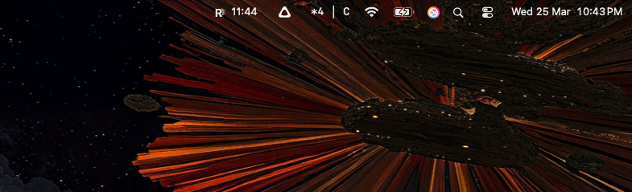
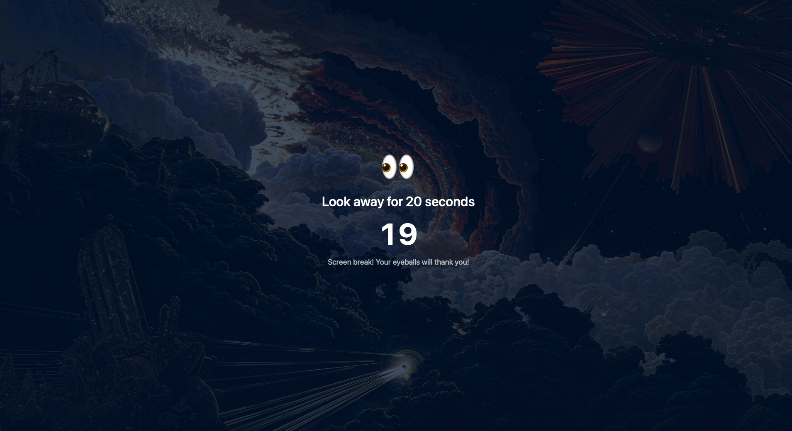

# Respiro

A macOS menu bar app that enforces the 20-20-20 rule: every 20 minutes, look at something 20 feet away for 20 seconds.

## Screenshots

Sits quietly in your menu bar, counting down to your next break.



Every 20 minutes, a full-screen overlay reminds you to look away.



## Features

- Lives in the menu bar with a countdown timer
- Full-screen overlay reminder across all connected displays
- Sound notifications when breaks start and end
- Pause/resume support

## Requirements

- macOS (Apple Silicon)
- Swift 5.9+

## Install

Download `Respiro.app.zip` from the [latest release](../../releases/latest), unzip, and move to `/Applications`.

## Build from source

```
bash build.sh
open Respiro.app
```

## License

MIT
